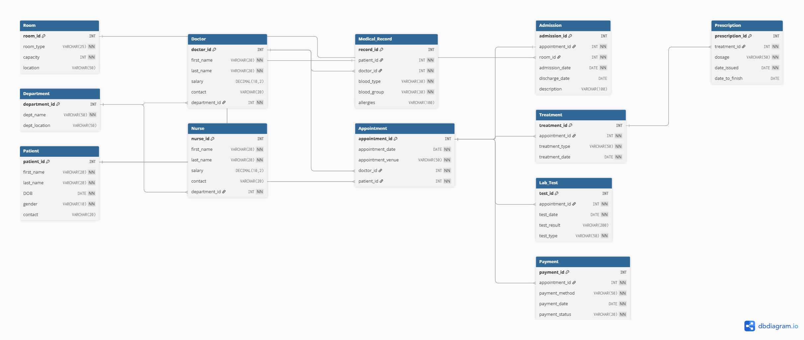

# Hospital Management System — SQL Database Project

## Overview
This project is a relational database for managing the day to day operations 
of a hospital. It covers everything from departments and staff to patient 
appointments, treatments, lab tests and payments. The goal was to design 
a clean, normalised database that reflects how a real hospital system 
would store and manage its data.

Built and tested using XAMPP and phpMyAdmin on a local machine.

## Tech Stack
- MySQL
- XAMPP (phpMyAdmin)
- SQL

## Database Structure
The database has 12 tables covering departments, rooms, doctors, nurses, 
patients, medical records, appointments, admissions, treatments, 
prescriptions, lab tests and payments.

A full ERD diagram is available in the docs folder.

## How to Run

Make sure XAMPP is installed and both Apache and MySQL are running 
in the XAMPP Control Panel before you start.

1. Open your browser and go to `http://localhost/phpmyadmin`
2. Create a new database and name it `hospital_management`
3. Open the SQL tab, paste the contents of `database/schema.sql` and click Go
4. Once the tables are created, paste the contents of `database/sample_data.sql` and click Go
5. To run the analytical queries open `database/queries.sql`, copy any query and run it in the SQL tab

## Project Structure

hospital-management-system/
├── database/
│   ├── schema.sql
│   ├── sample_data.sql
│   └── queries.sql
├── docs/
│   └── erd.png
├── README.md
└── .gitignore

## Design Notes
Tables were created first without any constraints, then primary keys, 
foreign keys and unique constraints were added separately using ALTER TABLE. 
This was a deliberate choice to show a clear understanding of how constraints 
work independently of table creation.

A unique constraint on the medical record table ensures each patient has 
only one record. A unique constraint on the admission table ensures one 
appointment can only produce one admission.

## Status
Complete — built and tested locally using XAMPP

 